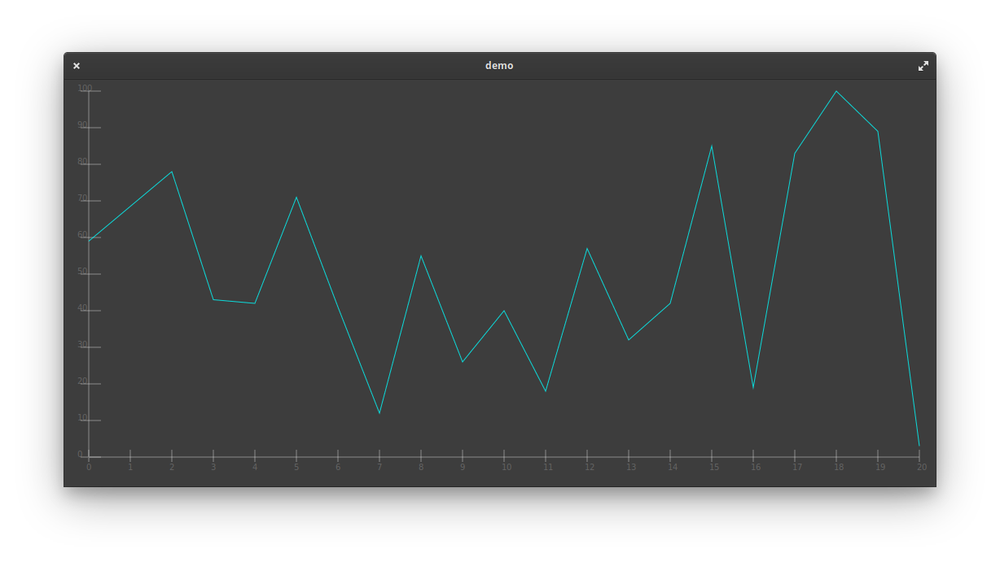
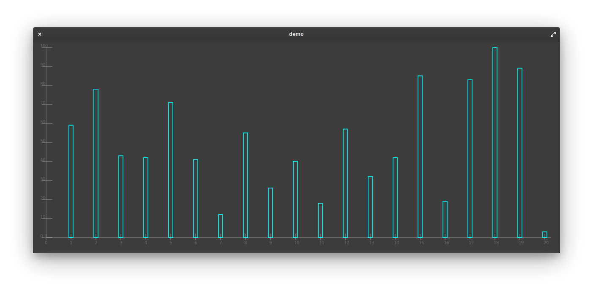
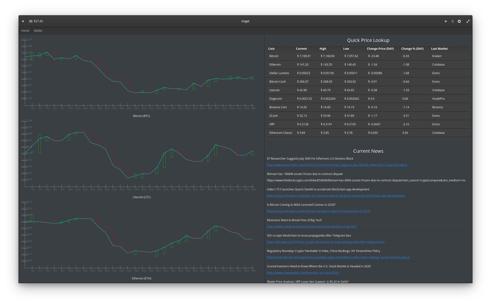

# Caroline
A simple Cairo Chart Library for GTK and Vala

Caroline is a simple and light interface into Cairo allowing a developer to create a chart in just a few lines of
code! Below is some screenshots of what you can do with it currently. Also below is a road map, documentation, and
some ramblings about the development process and inner-workings of Cairo and Caroline!





### Documentation

The documentation is broken up into several sections: Getting Started, Caroline Attributes, Caroline Functions, and Ramblings.

#### Getting Started

A sample application called "sample.vala" is included in this repo, it contains a simple application to show off how Caroline works. Below is a bare-bones example of how to interface with Caroline.
```
var widget = new Caroline ();
widget.DATA = {59,78,43,42,71,41,12,55,26,40,18,57,32,42,85,19,83,100,89,3};

widget.labelXList.add(0.to_string().concat(widget.dataTypeX));

for (int i = 1; i < widget.DATA.length+1; i++){

  widget.labelXList.add(i.to_string().concat(widget.dataTypeX));

}
```

This is how we generate a simple line chart. See the full sample application to learn more.

#### Caroline Attributes

Here we have all the attributes that will be changed regularly by the developer and not be changed
regularly, I will go in depth here on which one means and how it works.

##### Public Attributes

**DATA**
An array of data that is used to graph any of the chart types. You should put information into
it as an array of the double type. A simple example is right here:
`widget.DATA = {1,2,3,4,5,6,7,8,9,10};`

**width (int) DEFAULT: 500**
This attribute can be deceiving, but if you want your widget to start at a certain width then
you can set this attribute as a static number or use get_allocated_width() to set the widget
width. It can be deceiving because the parent width may not be large enough so it inherits that.

**height (int) DEFAULT: 500**
This attribute can be deceiving, but if you want your widget to start at a certain height then
you can set this attribute as a static number or use get_allocated_height() to set the widget
height. It can be deceiving because the parent height may not be large enough so it inherits that.

**chartPadding (int) DEFAULT: 14**
Chart padding is a little different from the private widthPadding and heightPadding attributes.
This attribute is meant to tell the system where you want to start plotting the lines on the canvas.
So even with 0 padding in widthPadding and heightPadding the ticks will still be visible fully.

**lineThicknessTicks DEFAULT: 0.5 (double)**
The thickness of the line ticks. Adjusting this attribute to much can have consequences on how other
parts of the system adjust to the thickness of the ticks.

**lineThicknessPlane DEFAULT: 1 (double)**
The thickness of the x and y axis lines. Adjusting this attribute to much can have consequences on how other parts of the system adjust to the thickness of the ticks.

**lineThicknessData DEFAULT: 2 (double)**
This adjusts the thickness of the lines for the "line" and "bar" chart. Adjusting this attribute to much can have consequences on how other parts of the system adjust to the thickness of the ticks.

**spreadY DEFAULT: 10 (double)**
The amount of y ticks you want in your chart. Since the default is 10, the internal calculations()
function will displays all of the DATA values over 10 ticks.

**dataTypeY DEFAULT: "" (string)**
If you want your data to units or types on the y axis you can put a string value in such as m for meters.

**dataTypeX DEFAULT: "" (string)**
If you want your data to units or types on the x axis you can put a string value in such as m for meters.

**chartType DEFAULT: "line" (string)**
The two options for charts at the moment are line or bar. This list will be expanded soon.
`widget.chartType = "bar";`

**labelXList DEFAULT: "" (ArrayList<string>)**
This list is meant to label the x ticks. This originally was a private attribute, but I wanted the
developer to be able to only put customized numbers rather then dynamically generated ones. In the
future this will be an option.

##### Private Attributes

**spreadFinalY DEFAULT: 0 (double)**
This attribute is used to tell our class how many pixels between each tick on the y axis there
should be. This is calculated internally within the draw() function.

**spreadFinalX DEFAULT: 0 (double)**
This attribute is used to tell our class how many pixels between each tick on the x axis there
should be. This is calculated internally within the draw() function.

**yTickStart DEFAULT: 20 (int)**
This attribute is used to figure out where the system wants to start plotting the y axis ticks.

**yTickEnd DEFAULT: 45 (int)**
This attribute is used to figure out where the system wants to end plotting the y axis ticks.

**yTextStart DEFAULT: 0 (int)**
This attribute is used to figure out where the system wants to start writing the data and unit text
on the y axis.

**xTickStart DEFAULT: 20 (int)**
This attribute is used to figure out where the system wants to start plotting the x axis ticks.

**xTickEnd DEFAULT: 5 (int)**
This attribute is used to figure out where the system wants to end plotting the x axis ticks.

**xTextStart DEFAULT: 11 (int)**
This attribute is used to figure out where the system wants to start writing the data and unit text
on the x axis.

**xTextEnd DEFAULT: 30 (int)**
This attribute is used to figure out where the system wants to stop writing the data and unit text
on the x axis.

**widthPadding DEFAULT: 50 (int)**
This attribute allows you to have some padding around the widget and the width limit. This will make
your chart look a bit better in tighter spots. Warning when changing this, it could have unforeseen
consequences for the positioning of things on the x axis.

**heightPadding DEFAULT: 11 (int)**
This attribute allows you to have some padding around the widget and the height limit. This will make
your chart look a bit better in tighter spots. Warning when changing this, it could have unforeseen
consequences for the positioning of things on the y axis.

**gap DEFAULT: 0 (double)**
The gap is a temporary attribute between the y axis ticks. This is calculated internally and will be over
written when the calculations() function is run.

**max DEFAULT: 0 (double)**
The max value within the DATA array which is found within the calculations() function.

**min DEFAULT: 0 (double)**
The min value within the DATA array which is found within the calculations() function.

**rectangleXOffset DEFAULT: 10 (int)**
Depending on the rectangle width it will need to be offset to be center on the x axis tick. This should
stay the same unless the width of the rectangles on the bar chart are changed.

**labelYList DEFAULT: "" (ArrayList<string>)**
The y axis labels for the tick marks are generated dynamically via the calculations() function
they should not be manually set!

#### Caroline Functions

**draw(Cairo.Context cr)**
In the draw function several things are occurring. Firstly we are running the calculations() function.
Secondly We are drawing the lines and ticks for the chart. Then depending on the 'chartType' attribute
calling a sub function lineChart() or barChart().

**calculations**
In this function we find the max, min, gap, and label values for the y axis. This sub function is meant to run
before any of the drawing occurs since these values are depended on throughout the code base. As this funciton
continues to grow it will be split into more sub functions.

**lineChart()**
This draws the line chart using some of the values mentioned earlier in the calculations function and uses
the Cairo.Context to finish drawing the entire line chart.

**barChart()**
This draws the bar chart using some of the values mentioned earlier in the calculations function and uses
the Cairo.Context to finish drawing the entire bar chart.
