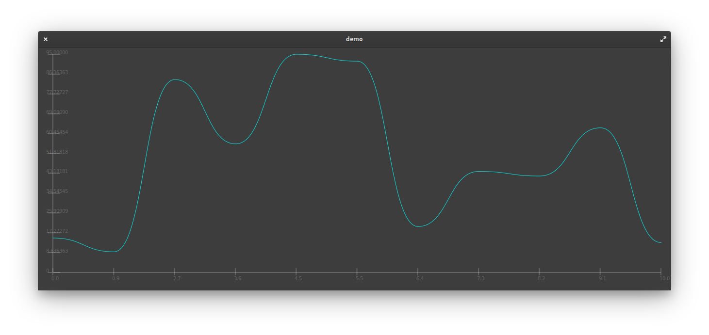
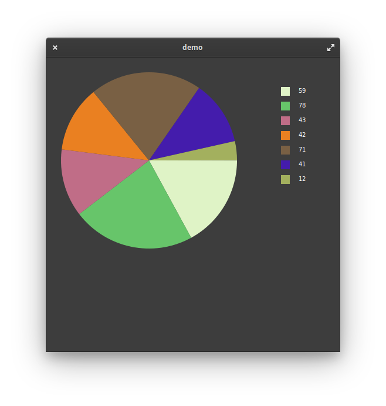
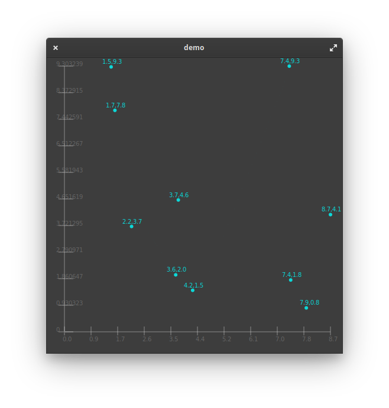

<br>
Logo Created By @stsdc
<br>
A simple Cairo Chart Library for GTK and Vala

Caroline is a simple and light interface into Cairo allowing a developer to create a chart in just a few lines of
code! Below is some screenshots of what you can do with it currently. Also below is a road map, documentation, and
some ramblings about the development process and inner-workings of Cairo and Caroline!







### Getting Started

#### Compiling & Installing

```
valac --pkg gtk+-3.0 --pkg gee-0.8 --library=Caroline -H Caroline.h Caroline.vala -X -fPIC -X -shared -o Caroline.so
valac --pkg gtk+-3.0 --pkg gee-0.8 Caroline.vapi Sample.vala -X Caroline.so -X -I. -o demo
sudo cp Caroline.so /usr/lib/
./demo
```

#### Simple Usage

A sample application called "Sample.vala" is included in this repo, it contains a simple application to show off how Caroline works. Below is a bare-bones example of how to interface with Caroline.
```
var carolineWidget = new Caroline(
  x, //dataX
  y, //dataY
  "scatter", //chart type
  true, //yes or no for generateColors function (needed in the case of the pie chart),
  false // yes or no for scatter plot labels
);
```

This is how we generate a simple line chart. See the full sample application to learn more.

### Caroline Documentation

Check out the code! It has lots of detailed documentation and try using the Sample.vala file.
